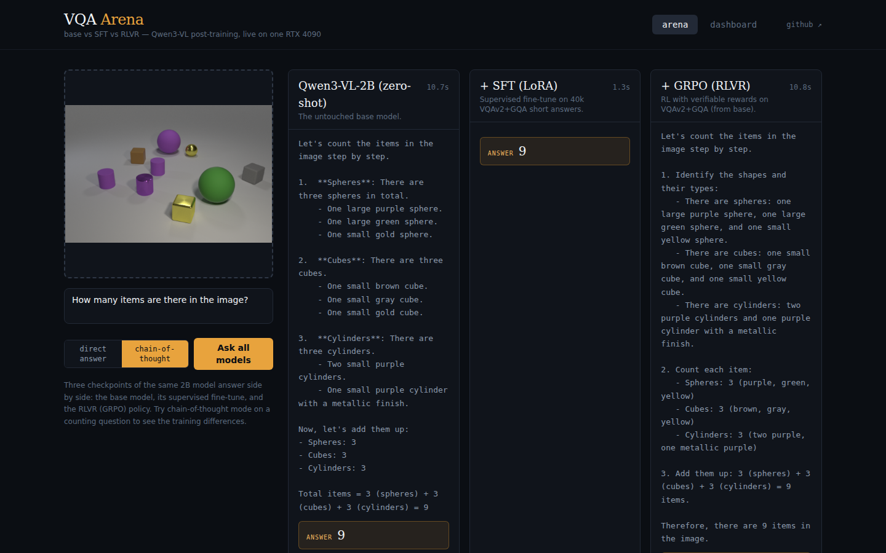

# vqa-rlvr

[](https://huggingface.co/omnifish123)
[](https://wandb.ai/ygbuestc-uci/vqa-rlvr)
[](LICENSE)
[](pyproject.toml)

**Post-training Qwen3-VL for visual question answering on a single RTX 4090:
QLoRA SFT plus GRPO reinforcement learning with verifiable rewards, benchmarked
across VQAv2 / GQA / CLEVR / TextVQA.**

In the spirit of [nanoVLM](https://github.com/huggingface/nanoVLM): a small, readable
codebase (6-file library + 4 entrypoints) that runs a complete, honest post-training
research loop on consumer hardware. Total cash cost: **$0 GPU + $0.19 LLM-judge**.

## Headline results

RLVR (GRPO, correctness + format rewards, 500 steps) on chain-of-thought VQA,
Qwen3-VL-2B, full eval sets:

| Reasoning mode | VQAv2-val | GQA-testdev | TextVQA-val (OOD) |
|---|---|---|---|
| zero-shot | 64.9 | 51.9 | 70.2 |
| + GRPO | **69.5** (+4.6) | **53.9** (+2.0) | **72.7** (+2.5) |

**Four findings we didn't expect:**

1. **RL prunes chain-of-thought when it doesn't pay.** With correctness-only rewards,
   GRPO deletes reasoning (17% retention). Reasoning *lowers* exact-match accuracy on
   perception-heavy VQA, so removing it is the optimal policy. A small format reward
   (weight 0.2) fully preserves it; 0.5 buys nothing more.
2. **The "cost" of reasoning is mostly a metric artifact.** Exact-match says keeping
   CoT costs 3.4 VQAv2 points; an LLM judge (which forgives verbosity, not wrongness)
   scores the CoT-retained model *higher* (81.8 vs 81.1). 23-49% of EM "misses" are
   semantic false negatives.
3. **Synthetic-to-natural transfer beats natural-to-natural.** RL on CLEVR alone (fully
   verifiable, zero natural images) produces the largest OOD gain (+5.3 TextVQA) and
   is the only training set that damages nothing.
4. **SFT silently destroys CoT compliance; RLVR restores it if exploration has a
   seed.** Short-answer SFT drove reasoning emission to 0/3000; GRPO amplified a 14%
   residual sampling rate back to 98% on diverse data, but could not resurrect it
   from the fully collapsed policy (the R1 cold-start lesson, reproduced).

Full tables (scale comparison, 4×4 transfer matrix, reward-design ablation, judge
study) are generated by `scripts/make_tables.py`; README numbers are never
hand-typed. See [`results/`](results/) for per-run JSONs with git SHAs and full
configs, and [`results/crosscheck.md`](results/crosscheck.md) for the lmms-eval
validation of our harness (59.5 vs 58.7±1.6 on GQA).

## Pipeline

```text
prepare_data.py      seeded, SHA-fingerprinted subsets of 4 datasets (89.6k examples)
      │              contamination-free: official disjoint splits, image-disjoint SFT/RL
      ▼
train_sft.py         TRL SFTTrainer + PEFT · LoRA (2B, bf16) / QLoRA (8B, NF4)
      │              prompt-completion masking (loss on answers only)
      ▼
train_grpo.py        TRL GRPOTrainer · vLLM colocated rollouts + sleep mode
      │              verifiable rewards: exact-match correctness + CoT format
      ▼              (+ optional budget-capped LLM-judge rescue)
merge_adapter.py ──► evaluate.py   vLLM batch eval → results/runs/*.json
```

## Quickstart

Requirements: 24 GB GPU (CUDA ≥12.8 driver), ~30 GB RAM, ~150 GB disk, Python 3.12.
The `uv.lock` pins a working torch/transformers/TRL/vLLM combination (cu129).

```bash
git clone https://github.com/guangboyu/vqa-rlvr && cd vqa-rlvr
uv sync              # pinned, reproducible environment
uv run pytest -q     # metric + reward unit tests, no GPU needed
```

Then run the full pipeline end to end:

```bash
# 1. Materialize the seeded dataset subsets (~45 GB of downloads)
uv run python prepare_data.py

# 2. 10-minute smoke evaluation of the 2B base model
uv run python evaluate.py --preset zero_shot_2b --limit 500

# 3. Supervised fine-tune (LoRA, ~1 h on a 4090)
uv run python train_sft.py --preset sft_2b

# 4. RLVR: GRPO with correctness + format rewards (~1.5 h)
uv run python train_grpo.py --preset grpo_2b_main --model Qwen/Qwen3-VL-2B-Instruct \
    --run-name my_rl_run

# 5. Merge the adapter (vLLM LoRA loading is broken for Qwen3-VL) and evaluate it
uv run python scripts/merge_adapter.py checkpoints/my_rl_run
uv run python evaluate.py --preset zero_shot_2b_reasoning \
    --model checkpoints/merged/my_rl_run --run-id my_rl_run
```

## Common tasks

### Evaluate on specific benchmarks

`evaluate.py` accepts any subset of the four datasets and a `short` or `reasoning`
(chain-of-thought) preset. Each run writes `results/runs/<run-id>-<dataset>.json`
with the metrics, git SHA, and full config, plus per-example predictions for error
analysis.

```bash
# Chain-of-thought template on two benchmarks
uv run python evaluate.py --preset zero_shot_2b_reasoning --datasets gqa textvqa

# Short-answer template, 8B model, capped for a quick check
uv run python evaluate.py --preset zero_shot_8b --datasets vqav2 --limit 1000
```

### Reproduce results from the published adapters

The adapter repos include the `run_config.json` the merge script needs, so a
downloaded adapter merges and evaluates exactly like a locally trained one:

```bash
uv run hf download omnifish123/vqa-rlvr-grpo-2b-main-base \
    --local-dir checkpoints/grpo_2b_main_base
uv run python scripts/merge_adapter.py checkpoints/grpo_2b_main_base
uv run python evaluate.py --preset zero_shot_2b_reasoning \
    --model checkpoints/merged/grpo_2b_main_base --run-id grpo_reproduced
```

| Adapter | HF Hub |
|---|---|
| 2B SFT (LoRA) | [vqa-rlvr-sft-2b](https://huggingface.co/omnifish123/vqa-rlvr-sft-2b) |
| 8B SFT (QLoRA) | [vqa-rlvr-sft-8b](https://huggingface.co/omnifish123/vqa-rlvr-sft-8b) |
| 2B GRPO (RL from base) | [vqa-rlvr-grpo-2b-main-base](https://huggingface.co/omnifish123/vqa-rlvr-grpo-2b-main-base) |
| 2B SFT→GRPO | [vqa-rlvr-grpo-2b-main-sft](https://huggingface.co/omnifish123/vqa-rlvr-grpo-2b-main-sft) |

### Customize GRPO rewards

Rewards come from a registry (`correctness`, `format`) with positional weights, so
reward-design ablations are one flag away. A dry run validates the dataset and
reward wiring before you commit GPU hours (no GPU or model needed).

```bash
# Reward-weight ablation arm: double the format reward
uv run python train_grpo.py --preset grpo_2b_main --model Qwen/Qwen3-VL-2B-Instruct \
    --rewards correctness format --reward-weights 1.0 0.5 --run-name fmt05

# Dry run: builds the RL dataset and scores a dummy completion through each reward
uv run python train_grpo.py --preset grpo_2b_main --dry-run
```

### Score predictions with the official VQA metrics

`vqar.metrics` ports the official VQAv2 accuracy (leave-one-out over 10 annotator
answers) and its normalization (articles, number words, punctuation), unit-tested
and cross-checked against lmms-eval. `score()` dispatches the right metric per
dataset.

```python
from vqar.metrics import score, vqa_accuracy

# VQAv2 / TextVQA: leave-one-out accuracy against the 10 annotator answers
vqa_accuracy("two", ["2", "2", "two", "2", "two", "2", "3", "2", "2", "2"])  # 1.0

# GQA / CLEVR: normalized exact match ("Four" -> "4", articles stripped)
score("clevr", "Four", ["4"])              # 1.0
score("gqa", "the frisbee", ["frisbee"])   # 1.0
```

### Run the LLM-judge study

The judge (Claude Haiku via the Batches API) re-scores exact-match misses to
measure false negatives. Calls are sqlite-cached and hard-capped at $10; the key
is read from a git-ignored project `.env`, never from the shell environment.

```bash
echo 'ANTHROPIC_API_KEY=sk-ant-...' > .env
uv run python scripts/judge_study.py --runs grpo_2b_main_base_reasoning-vqav2 --sample 400
cat results/judge_study.json   # rescue rates, judge-corrected accuracy, total spend
```

### Regenerate the result tables

```bash
# Rebuild every table from results/runs/*.json (README numbers are never hand-typed)
uv run python scripts/make_tables.py

# Re-score persisted predictions offline, e.g. after a metric fix
uv run python scripts/rescore.py
```

## Live demo: VQA Arena

A local web app (FastAPI + React) that runs all three 2B checkpoints side by side
on one 4090. Upload an image, ask a question, and watch base / SFT / RLVR stream
their answers concurrently; a second tab renders the results dashboard from the
committed run JSONs. Setup details in [`demo/`](demo/).

```bash
cd demo/frontend && npm install && npm run build && cd ../..
uv run --group demo uvicorn demo.backend.app:app --port 8000   # ~17 GB VRAM
# then open http://localhost:8000
```



## Method notes

- **Models**: Qwen3-VL-2B/8B-Instruct; nanoVLM-460M as a continuity baseline.
- **SFT**: LoRA r=16 on LM attention+MLP (vision tower frozen), 40k VQAv2+GQA
  mixture, 1 epoch. 8B uses NF4 QLoRA + paged 8-bit AdamW at lr 5e-5 (1e-4, the 2B
  recipe, measurably damaged counting and instruction-following).
- **GRPO**: group size 8, temperature 1.0, KL β=0, rewards = correctness (official
  VQA accuracy / normalized EM, strict answer-tag extraction) + 0.2 × format. The
  format reward targets the reasoning-then-answer *shape*, not literal `<think>`
  tags, which the model never samples and therefore can never be rewarded into.
- **Rollouts** run through vLLM's chat API via TRL's `rollout_func` so prompt
  construction has a single source of truth. TRL 1.8's built-in path hands vLLM
  pre-tokenized ids whose image-token expansion must exactly match vLLM's own
  preprocessing, and it silently corrupts prompts when it doesn't (reported
  upstream: [huggingface/trl#6401](https://github.com/huggingface/trl/issues/6401)).
- **Eval**: greedy, both a `short` template and a `reasoning` (CoT) template for
  every checkpoint; predictions persisted for error analysis and offline re-scoring.
- **Judge**: Claude Haiku 4.5 via the Batches API, sqlite-cached, hard $10 budget
  cap; used for the false-negative study and as an optional rescue reward.

## Known limitations & roadmap

- **8B GRPO does not fit on 24 GB** (colocated vLLM holds a second bf16 copy of the
  weights). `results/runs/grpo_8b_main-PLACEHOLDER.json` records the exact command;
  it runs unchanged on a ≥48 GB GPU. A 4B middle point is one preset away.
- Single seed per arm; reward-weight arms ran 300 steps vs the flagship's 500.
- Reasoning-retention is measured by completion-length proxy + spot reading;
  a faithfulness eval (does the answer follow from the reasoning?) is future work.
- Next: cloud 8B RL run, 3-seed error bars, process rewards, and a harder
  verifier domain (charts/documents) to test the synthetic-transfer finding.

## Acknowledgements

Built on [transformers](https://github.com/huggingface/transformers),
[TRL](https://github.com/huggingface/trl), [PEFT](https://github.com/huggingface/peft),
[vLLM](https://github.com/vllm-project/vllm), and
[lmms-eval](https://github.com/EvolvingLMMs-Lab/lmms-eval); inspired by
[nanoVLM](https://github.com/huggingface/nanoVLM),
[R1-V](https://github.com/Deep-Agent/R1-V), and DeepSeek-R1's GRPO recipe.

## License

Apache-2.0
