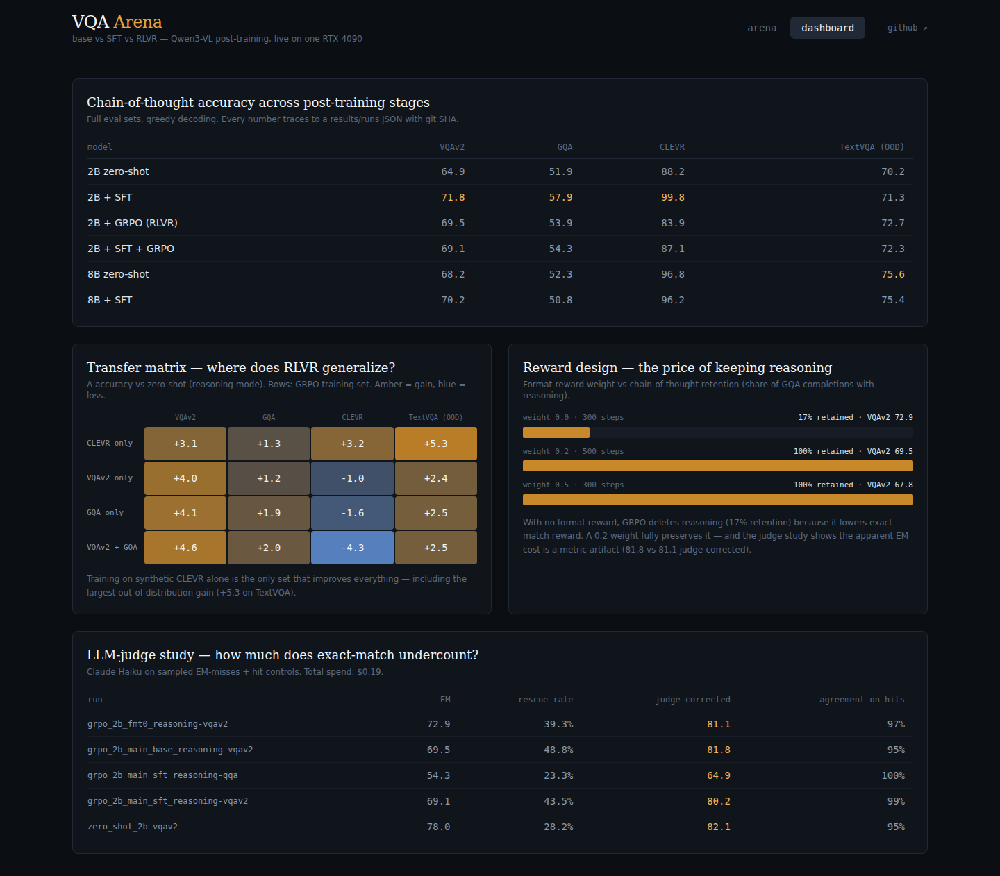

# VQA Arena — live demo

A local web app that puts the project's checkpoints side by side: upload any image,
ask a question, and watch the **zero-shot base**, **SFT**, and **GRPO (RLVR)**
policies of Qwen3-VL-2B answer concurrently, token by token, from one RTX 4090.
A second tab renders the paper-style results — main table, transfer-matrix heatmap,
reward-design ablation, and the LLM-judge study — straight from `results/`.




## Run it

```bash
# 1. Build the frontend once (Node ≥18)
cd demo/frontend && npm install && npm run build && cd ../..

# 2. Serve everything from one process (loads all three 2B models, ~17 GB VRAM)
uv run --group demo uvicorn demo.backend.app:app --host 0.0.0.0 --port 8000
```

Open http://localhost:8000. For frontend development, `npm run dev` serves Vite on
:5173 with `/api` proxied to :8000.

## How it works

- **Backend** (`backend/`): FastAPI. On startup, `ModelManager` loads the base
  model plus the two merged post-trained checkpoints (all bf16, ~17 GB total —
  they stay resident so answers start in under a second). `/api/ask` fans a
  question out to every model in its own thread; each `TextIteratorStreamer`
  pushes tokens into a shared asyncio queue, and the endpoint multiplexes them to
  the browser as one Server-Sent-Events stream tagged by model.
- **Frontend** (`frontend/`): React 19 + Vite + Tailwind. The Arena parses the
  stream per model, splitting chain-of-thought from the final `<answer>` tag as it
  arrives. The Dashboard fetches `/api/results`, which aggregates
  `results/runs/*.json` and the judge study — the same source of truth as the
  README tables (nothing is hand-typed).

## Requirements

Checkpoints must exist locally first — either run the pipeline (see the root
README) or merge the published adapters from
[HF Hub](https://huggingface.co/omnifish123) with `scripts/merge_adapter.py`.
Expected paths are listed in `backend/model_manager.py`.
